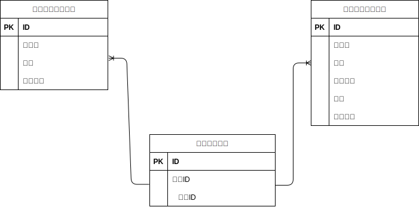

# mogitate

## 環境構築
- 1.git clone https://github.com/tetutora/mogitate
- 2.cd mogitate
- 3.git remote set-url origin 作成したリポジトリのURL
- 4.git remote -v で変更先のurlが表示されれば成功
- 5.git add .
- 6.git commit -m "リモートリポジトリの変更"
- 7.git push origin main で作成したリポジトリに変更が反映されていれば成功
- 8.Dockerのビルド  docker-compose up -d --build
- 9.PHPコンテナの起動  docker-compose exec php bash
- 10.パッケージのインストール  composer install
- 11..envファイルの作成  cp .env.example .env
- 12..envファイルの修正 DB_HOST=mysql、DB_DATABASE=laravel_db、DB_USERNAME=laravel_user、DB_PASSWORD=laravel_pass
- 13.php artisan key:generate コマンド実行
- 14.シーディングの実行 php artisan db:seed
- 15.完了

## 使用技術（実行環境）
- ・Laravel 8.83.29 (PHP Laravel)
- ・MySQL 8.0.26 (データベース)
- ・Nginx 1.21.1(Web サーバー)
- ・PHP 8.3.13 (PHP 実行環境)
- ・Docker (開発環境のコンテナ管理)

## ER図

## URL
- 開発環境: http://localhost
